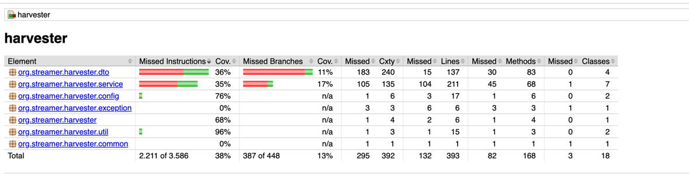

## Data Harvester

This solution implements asynchronous calls to the Video Streaming service, capturing events and doing some manipulation on these Video events

I am using the Spring Boot with Spring WebFlux. The reason is that, seeing the log from the app in the image sytacdocker/video-stream-server:latest
I noticed that it is running with the Netty server, and that may indicate the usage of Spring Web Flux (Reactive).

The events weren't captured very well if I used the standard Flux decoder, so I observed that the VideoStreamer service produced Server Sent Events, a
different standard which in some ways resembles the WebSocket technology.

### Description

- The main service is the DataHarvesterService. It calls the functions on DataHarvesterCollectorService, which calls the 3 event video pipelines
- Some functions are being used to guarantee failure response (like retry mechanism with exponential backoff)
- The 3 Flux from Sysflix, Systazon and Sysney are merged and I apply the funcions to stop in 20 seconds, or until we find the User Sytac
- Configuration is done using the `src/main/java/resources/application.properties`
- All the results are presented in CSV format

### Technical Solution

The solution is implemented in a layered structure, based on the MVC: `services` (which interfaces with the controllers on actions which 
implements high level requirements and coordinates actions among other services), repositories (which access the permanent storage),
The technologies used for the REST API were: Java 17, Spring Boot, Spring Framework, Spring Web Flux (Reactor).

All of these were delivered using containers orchestraded with docker compose. All services are loaded using the docker-compose.

### Getting Started

## How to run?

The application can be run in development or production mode by applying the following steps.
<br/>

### Prerequisites

The following apps should be installed before running the application:

- A command line app
- Docker Desktop

> **Note** <br/>
> For more information regarding the system requirements, etc. refer to the following pages: <br/>
> [Install on Mac](https://docs.docker.com/desktop/install/mac-install/)<br/>
> [Install on Windows](https://docs.docker.com/desktop/install/windows-install/)<br/>
> [Install on Linux](https://docs.docker.com/desktop/install/linux-install/)<br/>

<br/>

### Running the app

In order to run the application in development mode, apply the following steps:

1. Run Docker desktop.

<br/>

2. Open command prompt window and clone the project from GitHub using the following command:

```
git clone https://github.com/Sytac-DevCase/Java-rosfran/tree/harvester_v1.git
```
<br/>

3. Change the current directory to the project directory where the `docker-compose.yml` file is in:

```
cd Java-rosfran
```
<br/>

4. Run the following command:

You can use:

```
docker-compose  up --build
```
Or in some Docker installations:
```
docker compose  up --build
```


### Testing

I used  Unit Testing for testing the application.

To test the application, we use Maven:
```
mvn test
```
The test reports are generated as Surefire (https://maven.apache.org/surefire/maven-surefire-plugin/) and Jacoco (http://jacoco.org).

To generate the Jacoco reports you need to run the following:
```
mvn jacoco:report
```
To open the Jacoco reports, which are generated by the command above, go to: `$PATH/target/site/jacoco/index.html`

It is important to have tools like Jacoco or Sonar, to take care of the tests coverage and where to create more tests.

Example below (it is on 38% of code coverage):



### Troubleshooting

Some problems can happen when there is any other process using the same port of the application, and _"ports are not available"_ or _"port is already in use"_ errors might be encountered.
In this situation, terminating that process and restarting the related containers will fix the problem. If the problem continues,
delete the containers (db, backend and frontend) and re-run the `docker compose` command in the previous step.

<br/>

### Documentation

[docker compose up](https://docs.docker.com/engine/reference/commandline/compose_up/)<br/>


<br/>
<br/>
<br/>

### Dependencies

* Spring Boot
* Spring Web Flux
* Spring Security
* Spring Data JPA
* Lombok

<br/>

### Documentation
[Spring Boot](https://docs.spring.io/spring-boot/docs/current/reference/htmlsingle/)<br/>


### Version History

* v1.0.0 Initial Release

